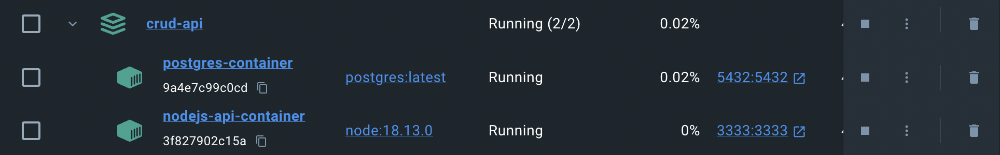

# AdonisJS CRUD API

# Overview

Simple CRUD API made with [AdonisJS](https://adonisjs.com/).

# Prerequisites

```bash
Git
# For Docker Compose
Docker version 24.0.6
Docker Compose version v2.22.0-desktop.2
# For Local Development
NodeJS v18.13.0
npm 8.19.3
Docker version 24.0.6
```

# Recommended
Install [Docker Desktop](https://www.docker.com/products/docker-desktop/)

# How to get started

Open a terminal (or PowerShell terminal if you are on Windows) and clone this repository :

```bash
git clone https://github.com/sceballos/adonis-crud-api.git && cd adonis-crud-api
```

## Running project using docker-compose

### Create a `.env` file

If you want to use `docker-compose` to run the project run the following command to copy the proper `.env.example` file:

```bash
#For Docker Compose
cp .env.example.compose .env
```

If you decide on using Docker Compose you can run the database along with the server using the following command (depending on your available Docker images this might about 2 minutes to complete) : 
```bash
docker-compose up
```

If you are using Docker Desktop you should be able to visualize the postgres and api container running in the `Containers` screen :



For this case, the functional test suite will run before starting the API server.
Once the API is running you will be able to access it at http://127.0.0.1:3333 (or a different port if `PORT` environment variable was modified in the `.env` file).


## Running project for local development

### Create a `.env` file

If you want to run the project for local development run : 
```bash
#For local development
cp .env.example.local .env
```

Make sure you have `node` installed. If your node version is different from `v18.13.0` consider using [nvm](https://github.com/nvm-sh/nvm) to install the specified version.

```bash
node -v
v18.13.0
```

### Install required dependencies

```bash
npm i
```

### Run main Postgres database

```bash
#if you modify `.env` before running this command make sure `POSTGRES_USER`, `POSTGRES_PASSWORD` and `POSTGRES_DB` match the same values defined in `.env` .
docker pull postgres && docker run --name mainPostgres -p 5432:5432 -e POSTGRES_USER=postgres -e POSTGRES_PASSWORD=postgres -e POSTGRES_DB=postgres -d postgres
```

### Run development server

```bash
node ace serve --watch
```
Once the API is running you will be able to access it at http://127.0.0.1:3333 (or a different port if `PORT` environment variable was modified in the `.env` file).

### Run tests

```bash
node ace test
```
